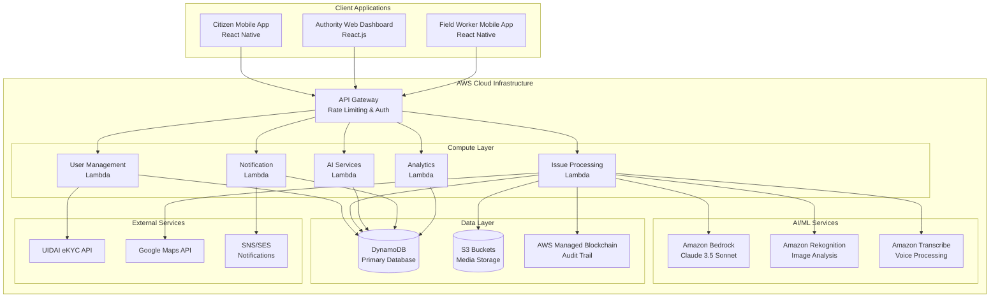

# Design Document: Civic Solvers Platform

## Overview

The Civic Solvers platform is a cloud-native, AI-powered civic issue reporting system built on AWS infrastructure. The system follows a microservices architecture with three primary client applications (Citizen Mobile App, Authority Web Dashboard, Field Worker Mobile App) connecting to a unified backend through API Gateway. The platform leverages Amazon Bedrock for AI processing, DynamoDB for scalable data storage, and AWS Managed Blockchain for transparent audit trails.

The design emphasizes real-time processing, offline capability, multilingual support, and comprehensive security. The system is designed to handle 50,000 concurrent users with scalability to 500,000, maintaining sub-200ms API response times and 99.9% uptime.

## Architecture

### High-Level Architecture



### Microservices Architecture

The backend is organized into five core microservices:

1. **User Management Service**: Handles authentication, user profiles, and Aadhaar eKYC integration
2. **Issue Processing Service**: Manages issue lifecycle, AI categorization, and workflow orchestration  
3. **AI Services**: Coordinates Amazon Bedrock, Rekognition, and Transcribe for intelligent processing
4. **Notification Service**: Manages push notifications, SMS, email, and real-time updates
5. **Analytics Service**: Provides reporting, KPIs, predictive insights, and performance metrics

### Security Architecture

- **Authentication**: AWS Cognito with Aadhaar eKYC integration
- **Authorization**: Role-based access control (RBAC) with JWT tokens
- **Data Encryption**: AES-256 encryption at rest, TLS 1.3 in transit
- **API Security**: AWS WAF with rate limiting and DDoS protection
- **Compliance**: DPDPA 2023 compliant with data residency in India

## Components and Interfaces

### Client Applications

#### Citizen Mobile App (React Native)

**Core Components:**
- `AuthenticationModule`: Aadhaar eKYC integration and session management
- `IssueReportingModule`: Camera, GPS, voice recording, and offline sync
- `StatusTrackingModule`: Real-time updates and notification handling
- `GamificationModule`: Civic Score, badges, and leaderboard display
- `MapModule`: Interactive issue visualization and location services
- `OfflineModule`: Local storage and sync queue management

**Key Interfaces:**
```typescript
interface IssueReport {
  id: string;
  citizenId: string;
  category: IssueCategory;
  description: string;
  location: GeoLocation;
  photos: MediaFile[];
  voiceNote?: MediaFile;
  timestamp: Date;
  status: IssueStatus;
  severityScore?: number;
}

interface CitizenProfile {
  id: string;
  aadhaarHash: string;
  civicScore: number;
  trustScore: number;
  preferredLanguage: Language;
  notificationPreferences: NotificationSettings;
}
```

#### Authority Web Dashboard (React.js)

**Core Components:**
- `DashboardModule`: KPI visualization and real-time metrics
- `IssueManagementModule`: Queue management, filtering, and assignment
- `WorkforceModule`: Field worker management and task assignment
- `AnalyticsModule`: Reporting, heat maps, and predictive insights
- `AdminModule`: User management and system configuration
- `IntegrationModule`: ERP system connectivity and data export

**Key Interfaces:**
```typescript
interface AuthorityUser {
  id: string;
  role: AuthorityRole; // Admin, Manager, Supervisor
  permissions: Permission[];
  assignedAreas: GeoArea[];
  department: Department;
}

interface IssueQueue {
  issues: IssueReport[];
  filters: FilterCriteria;
  sortBy: SortOption;
  pagination: PaginationInfo;
}
```

#### Field Worker Mobile App (React Native)

**Core Components:**
- `TaskManagementModule`: Daily task list and priority management
- `NavigationModule`: GPS routing and AR overlay for issue location
- `ResolutionModule`: Before/after photo capture and status updates
- `CommunicationModule`: Supervisor chat and support requests
- `TimeTrackingModule`: Work duration and productivity metrics

**Key Interfaces:**
```typescript
interface WorkerTask {
  id: string;
  issueId: string;
  workerId: string;
  priority: Priority;
  estimatedDuration: number;
  location: GeoLocation;
  status: TaskStatus;
  assignedAt: Date;
  dueDate: Date;
}

interface ResolutionRecord {
  taskId: string;
  beforePhotos: MediaFile[];
  afterPhotos: MediaFile[];
  resolutionNotes: string;
  timeSpent: number;
  materialsUsed?: string[];
  completedAt: Date;
}
```

### Backend Services

#### User Management Service

**Responsibilities:**
- Aadhaar eKYC authentication via UIDAI API
- User profile management and session handling
- Role-based access control and permissions
- Civic Score and Trust Score calculation

**API Endpoints:**
- `POST /auth/ekyc` - Initiate Aadhaar authentication
- `GET /users/{id}/profile` - Retrieve user profile
- `PUT /users/{id}/preferences` - Update user preferences
- `GET /users/{id}/scores` - Get Civic and Trust scores

#### Issue Processing Service

**Responsibilities:**
- Issue ingestion and validation
- AI-powered categorization and spam detection
- Workflow orchestration and status management
- Duplicate detection and merging

**API Endpoints:**
- `POST /issues` - Submit new issue report
- `GET /issues/{id}` - Retrieve issue details
- `PUT /issues/{id}/status` - Update issue status
- `GET /issues/search` - Search and filter issues

#### AI Services

**Responsibilities:**
- Amazon Bedrock integration for NLP processing
- Amazon Rekognition for image analysis
- Amazon Transcribe for voice-to-text conversion
- Spam detection and duplicate identification

**Processing Pipeline:**
1. **Text Analysis**: Extract key information, categorize, detect spam
2. **Image Analysis**: Identify issue type, assess severity, verify authenticity
3. **Voice Processing**: Transcribe to text, language detection, sentiment analysis
4. **Duplicate Detection**: Compare with existing reports using similarity algorithms

## Data Models

### Core Entities

#### Issue Report
```typescript
interface IssueReport {
  // Primary identifiers
  id: string;                    // UUID
  citizenId: string;            // Reporting citizen ID
  trackingNumber: string;       // Human-readable tracking ID
  
  // Content and classification
  category: IssueCategory;      // AI-assigned category
  subcategory?: string;         // Detailed classification
  title: string;               // Auto-generated or user-provided
  description: string;          // Citizen description
  aiExtractedInfo: string;     // AI-processed key information
  
  // Location and media
  location: GeoLocation;        // GPS coordinates
  address: Address;            // Formatted address
  photos: MediaFile[];         // Issue photos
  voiceNote?: MediaFile;       // Optional voice recording
  
  // AI analysis results
  severityScore: number;       // 1-10 AI-calculated priority
  spamProbability: number;     // 0-1 spam likelihood
  duplicateOf?: string;        // Reference to original if duplicate
  aiConfidence: number;        // AI categorization confidence
  
  // Workflow and status
  status: IssueStatus;         // Current workflow state
  assignedTo?: string;         // Field worker ID
  estimatedResolution: Date;   // AI-predicted completion
  actualResolution?: Date;     // Actual completion time
  
  // Audit and blockchain
  blockchainHash: string;      // Blockchain record reference
  statusHistory: StatusChange[]; // Complete audit trail
  
  // Timestamps
  createdAt: Date;
  updatedAt: Date;
}

enum IssueCategory {
  ROADS = 'roads',
  LIGHTING = 'lighting', 
  SANITATION = 'sanitation',
  WATER = 'water',
  DRAINAGE = 'drainage',
  PARKS = 'parks',
  TRAFFIC = 'traffic',
  OTHER = 'other'
}

enum IssueStatus {
  SUBMITTED = 'submitted',
  VERIFIED = 'verified',
  ASSIGNED = 'assigned',
  IN_PROGRESS = 'in_progress',
  RESOLVED = 'resolved',
  REJECTED = 'rejected',
  DUPLICATE = 'duplicate'
}
```

#### User Profiles
```typescript
interface CitizenProfile {
  id: string;
  aadhaarHash: string;         // Hashed Aadhaar for privacy
  phoneNumber: string;
  email?: string;
  
  // Gamification
  civicScore: number;          // Engagement and quality metric
  trustScore: number;          // AI-calculated reliability
  badges: Badge[];             // Earned achievements
  reportsSubmitted: number;
  reportsResolved: number;
  
  // Preferences
  preferredLanguage: Language;
  notificationSettings: NotificationPreferences;
  privacySettings: PrivacySettings;
  
  // Location and verification
  primaryLocation: GeoLocation;
  verificationLevel: VerificationLevel;
  
  createdAt: Date;
  lastActiveAt: Date;
}

interface FieldWorker {
  id: string;
  employeeId: string;
  name: string;
  phoneNumber: string;
  
  // Work assignment
  department: Department;
  skills: Skill[];
  workingAreas: GeoArea[];
  availability: AvailabilitySchedule;
  
  // Performance metrics
  tasksCompleted: number;
  averageResolutionTime: number;
  qualityRating: number;
  currentWorkload: number;
  
  // Location tracking
  currentLocation?: GeoLocation;
  lastLocationUpdate?: Date;
  
  isActive: boolean;
  createdAt: Date;
}
```

#### Blockchain Records
```typescript
interface BlockchainRecord {
  transactionId: string;
  issueId: string;
  eventType: BlockchainEventType;
  actorId: string;             // User who performed action
  actorRole: UserRole;
  previousHash: string;
  currentHash: string;
  payload: any;                // Event-specific data
  timestamp: Date;
  blockNumber: number;
}

enum BlockchainEventType {
  ISSUE_CREATED = 'issue_created',
  STATUS_CHANGED = 'status_changed',
  ASSIGNED = 'assigned',
  RESOLVED = 'resolved',
  VERIFIED = 'verified'
}
```

### Database Schema Design

#### DynamoDB Table Structure

**Issues Table (Primary)**
- Partition Key: `issueId`
- Sort Key: `createdAt`
- GSI1: `citizenId` (PK) + `createdAt` (SK) - User's reports
- GSI2: `status` (PK) + `severityScore` (SK) - Status-based querying
- GSI3: `category` (PK) + `location.geoHash` (SK) - Geographic queries
- GSI4: `assignedTo` (PK) + `dueDate` (SK) - Worker task lists

**Users Table**
- Partition Key: `userId`
- GSI1: `aadhaarHash` (PK) - eKYC lookup
- GSI2: `civicScore` (PK) + `userId` (SK) - Leaderboards

**Analytics Table**
- Partition Key: `metricType`
- Sort Key: `timestamp`
- TTL: 2 years for automatic cleanup

#### S3 Bucket Organization
```
civic-solvers-media/
├── issues/
│   ├── {issueId}/
│   │   ├── photos/
│   │   └── voice/
├── resolutions/
│   └── {taskId}/
│       ├── before/
│       └── after/
└── temp/
    └── {uploadId}/
```

## Error Handling

### Error Classification and Response Strategy

#### Client-Side Error Handling

**Network Errors:**
- Offline mode activation with local storage
- Automatic retry with exponential backoff
- User notification with retry options
- Queue management for pending operations

**Validation Errors:**
- Real-time form validation with clear messaging
- Multilingual error messages
- Guided correction suggestions
- Prevention of invalid submissions

**Authentication Errors:**
- Automatic token refresh
- Graceful re-authentication flow
- Session timeout warnings
- Secure credential storage

#### Server-Side Error Handling

**AI Service Failures:**
- Fallback to manual categorization queue
- Graceful degradation of AI features
- Error logging and monitoring
- Alternative processing paths

**Database Errors:**
- Automatic failover to secondary regions
- Transaction rollback mechanisms
- Data consistency validation
- Recovery procedures

**External API Failures:**
- Circuit breaker pattern implementation
- Cached responses where appropriate
- Alternative service providers
- User notification of service limitations

### Error Response Format
```typescript
interface ErrorResponse {
  error: {
    code: string;           // Machine-readable error code
    message: string;        // Human-readable message
    details?: any;          // Additional error context
    timestamp: Date;
    requestId: string;      // For tracking and support
    retryable: boolean;     // Whether client should retry
  };
}
```

## Testing Strategy

### Dual Testing Approach

The Civic Solvers platform requires comprehensive testing combining unit tests for specific scenarios and property-based tests for universal correctness validation.

#### Unit Testing Strategy

**Focus Areas:**
- **Authentication flows**: eKYC integration, session management, role validation
- **API endpoints**: Request/response validation, error handling, edge cases
- **UI components**: User interactions, form validation, accessibility compliance
- **Integration points**: External API connections, database operations, blockchain transactions
- **Edge cases**: Network failures, invalid inputs, boundary conditions

**Testing Framework:**
- **Frontend**: Jest + React Testing Library for React.js/React Native
- **Backend**: Jest + Supertest for Node.js Lambda functions
- **E2E**: Cypress for critical user journeys

#### Property-Based Testing Strategy

**Configuration:**
- **Library**: fast-check for JavaScript/TypeScript
- **Iterations**: Minimum 100 iterations per property test
- **Tagging**: Each test references design document property with format:
  `// Feature: civic-solvers, Property {number}: {property_text}`

**Property Test Categories:**
1. **Data Integrity Properties**: Ensure data consistency across operations
2. **AI Processing Properties**: Validate categorization and spam detection accuracy
3. **Workflow Properties**: Verify state transitions and business rules
4. **Security Properties**: Validate authentication and authorization rules
5. **Performance Properties**: Ensure response time and scalability requirements

**Property Test Implementation:**
- Generate random valid inputs for comprehensive coverage
- Test invariants that must hold across all valid operations
- Validate round-trip properties for serialization/deserialization
- Verify metamorphic properties for AI processing results

#### Integration Testing

**API Integration:**
- Contract testing with external services (UIDAI, Google Maps)
- Database integration with DynamoDB and S3
- Blockchain integration with AWS Managed Blockchain
- AI service integration with Amazon Bedrock, Rekognition, Transcribe

**Performance Testing:**
- Load testing for 50,000 concurrent users
- Stress testing for scalability validation
- API response time validation (sub-200ms requirement)
- Database query performance optimization

#### Security Testing

**Penetration Testing:**
- Authentication bypass attempts
- Authorization escalation testing
- Input validation and injection attacks
- Data encryption verification

**Compliance Testing:**
- DPDPA 2023 compliance validation
- WCAG 2.1 Level AA accessibility testing
- Data residency and privacy controls
- Audit trail completeness verification

## Correctness Properties

*A property is a characteristic or behavior that should hold true across all valid executions of a system—essentially, a formal statement about what the system should do. Properties serve as the bridge between human-readable specifications and machine-verifiable correctness guarantees.*

### Property 1: Authentication State Consistency
*For any* citizen with valid Aadhaar credentials, successful eKYC authentication should create a verified user profile, enable subsequent logins without re-verification, and maintain secure sessions for the specified duration.
**Validates: Requirements 1.2, 1.4, 1.5**

### Property 2: Report Submission Completeness  
*For any* valid issue report submission, the system should generate a unique tracking ID, capture all required metadata (GPS, timestamp), and provide confirmation to the citizen.
**Validates: Requirements 2.2, 2.7**

### Property 3: Offline Synchronization Integrity
*For any* reports created while offline, when network connectivity is restored, all locally stored reports should be synchronized without data loss and receive the same processing as online reports.
**Validates: Requirements 2.6**

### Property 4: AI Processing Completeness
*For any* submitted report with text, voice, or image content, the AI system should perform categorization, severity scoring (1-10 range), spam detection (0-1 probability), and duplicate detection within specified constraints.
**Validates: Requirements 3.1, 3.2, 3.4, 3.6**

### Property 5: Duplicate Detection Accuracy
*For any* two reports submitted within 500-meter radius and 7-day window with similar content, the duplicate detection system should identify the similarity and link the reports appropriately.
**Validates: Requirements 3.5**

### Property 6: AI Fallback Reliability
*For any* AI processing failure, the system should gracefully route issues to manual review queues without losing report data or blocking citizen submissions.
**Validates: Requirements 3.7**

### Property 7: Blockchain Audit Trail Completeness
*For any* report submission or status change, the blockchain ledger should create immutable records with proper timestamps, actor identification, and digital signatures, maintaining a complete audit trail accessible to authorized users.
**Validates: Requirements 4.1, 4.2, 4.4, 4.5**

### Property 8: Role-Based Access Control
*For any* authority user login, the dashboard should display interface elements and data access appropriate to their specific role (Admin, Manager, Supervisor) and assigned geographic areas.
**Validates: Requirements 5.1**

### Property 9: Issue Queue Management Consistency
*For any* issue queue view, reports should be properly categorized, sorted by severity score, and support all specified filter combinations (category, location, severity, date, status).
**Validates: Requirements 5.2, 5.3**

### Property 10: Task Assignment Validation
*For any* task assignment (manual or automatic), the system should verify field worker availability, location constraints, and workload capacity before confirming assignment.
**Validates: Requirements 5.5, 5.6**

### Property 11: SLA Escalation Timeliness
*For any* issue approaching SLA deadline, the system should trigger appropriate escalation notifications to supervisors with sufficient advance notice.
**Validates: Requirements 5.7**

### Property 12: Field Worker Location Verification
*For any* field worker arrival at an issue location, the system should verify GPS presence within 50-meter radius before allowing task progression and resolution documentation.
**Validates: Requirements 6.3**

### Property 13: Resolution Documentation Requirements
*For any* issue resolution attempt, the system should enforce capture of before/after photos with GPS timestamps and proper metadata, or allow "Cannot Resolve" marking with mandatory reason selection.
**Validates: Requirements 6.5, 6.6**

### Property 14: Gamification Score Consistency
*For any* citizen with report history, Civic Score and Trust Score calculations should be based on consistent algorithms considering report quality, resolution success, accuracy, and community validation.
**Validates: Requirements 7.1, 7.2**

### Property 15: Geographic Constraint Enforcement
*For any* citizen attempting to upvote existing reports, the system should only allow upvoting for reports within 1-kilometer radius of their current location.
**Validates: Requirements 7.3**

### Property 16: Notification Delivery Reliability
*For any* status change, resolution, or broadcast announcement, the system should deliver appropriate notifications to affected users and maintain delivery history with read/unread status.
**Validates: Requirements 8.1, 8.3, 8.4, 8.5**

### Property 17: Multilingual Content Consistency
*For any* supported language selection, the system should provide complete UI translation and maintain consistent formatting across all content types and user interfaces.
**Validates: Requirements 9.1, 9.3**

### Property 18: Voice Processing Accuracy
*For any* voice input in supported Indian languages, the system should accurately transcribe speech to text and handle regional language variations appropriately.
**Validates: Requirements 9.2**

### Property 19: Analytics Data Integrity
*For any* historical data analysis, the system should accurately identify patterns, generate predictive insights, and calculate KPIs based on complete and consistent data sets.
**Validates: Requirements 11.1, 11.2, 11.3, 11.4, 11.5**

### Property 20: API Integration Reliability
*For any* external system integration request, the platform should maintain secure connections, enforce rate limiting and authentication, and ensure bidirectional data synchronization without loss.
**Validates: Requirements 12.1, 12.2, 12.3**

### Property 21: System Recovery Resilience
*For any* system failure scenario, the platform should implement graceful degradation, maintain data integrity, and execute automatic recovery mechanisms without permanent data loss.
**Validates: Requirements 12.4**